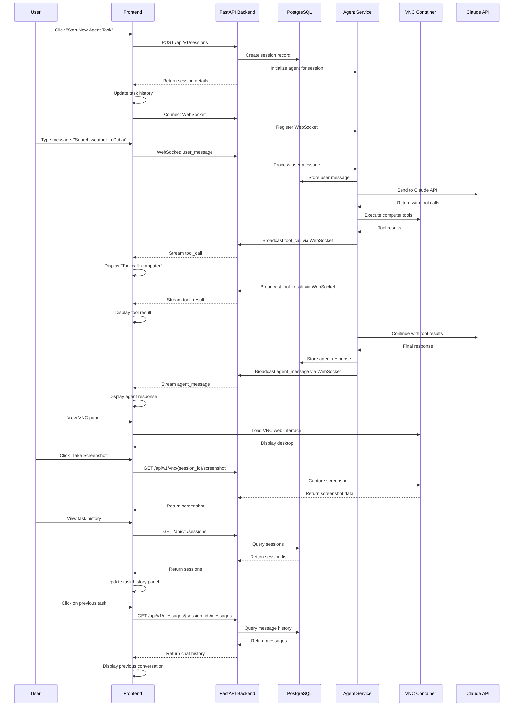
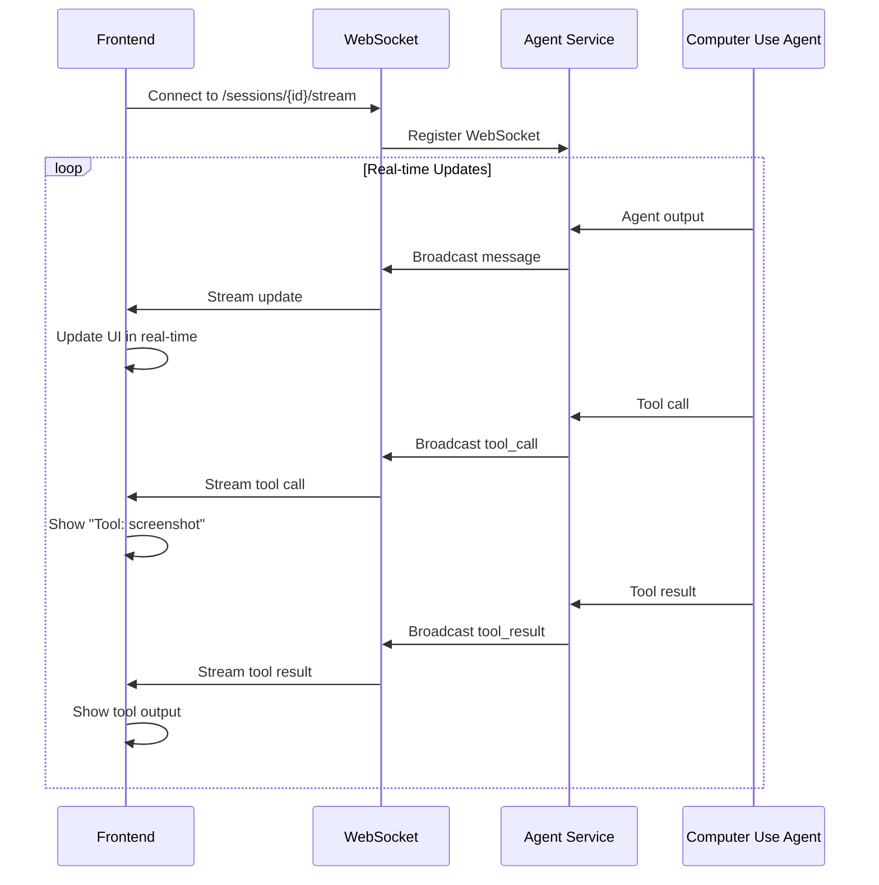
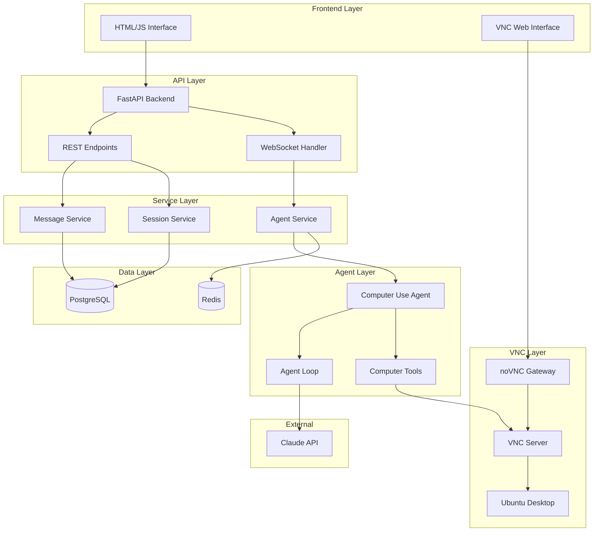

# Sequence Diagram

This document shows the sequence of interactions in the VNCagentic system.

## User Session Flow

## Real-time Streaming Flow

## Architecture Components

## Key Features Demonstrated

1. **Session Management**: Multiple concurrent sessions with persistent history
2. **Real-time Streaming**: WebSocket-based live updates from agent
3. **VNC Integration**: Embedded desktop view and screenshot capabilities
4. **Database Persistence**: All conversations and sessions stored
5. **Computer Use Tools**: Full integration with existing Anthropic tools
6. **REST API**: Complete CRUD operations for sessions and messages
